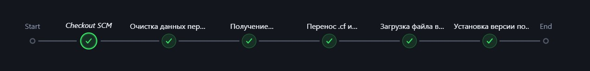

# ГРМ

**ГРМ** (Глобальный релизный менеджер) — сервис 1С для отправки файла `.dt`, созданного на основе пустой базы актуальной версии релиза.

## Файлы

Файлы хранятся в папке `GRM`:

| Файл               | Описание                                                                 |
|--------------------|--------------------------------------------------------------------------|
| `Jenkinsfile`      | Основной файл для запуска процесса отправки в Jenkins.                   |
| `cleaning.py`      | Очищает содержимое папок `D:\dt` и `D:\cf`.                             |
| `transfer.py`      | Копирует файл `.cf` из папки `Old_versions_cf` в `D:\cf`.               |
| `upload_file.py`   | Выполняет PUT-запрос для отправки файла `.dt` в ГРМ.                     |

### Принцип работы

1. Очистка папок `D:\dt` и `D:\cf`.
2. Получение ссылки на предписание.
3. Копирование файла `.cf` из `D:\release_build\FITNESSCORP\Old_versions_cf` в `D:\cf`.
4. Загрузка файла `.cf` в пустую базу, обновление конфигурации и выгрузка файла `.dt` в папку `D:\dt`.
5. Отправка файла `.dt` в объектное хранилище ГРМ.
6. Установка версии по умолчанию.

### Запуск

Процесс полностью автоматизирован. Запуск выполняется через **Jenkins**:

1. Перейдите в раздел **Сборки релизов → GRM → Собрать с параметрами**.
2. Укажите параметры:
   - **nameProduct**: Выберите продукт (`fitnessCorp`, `SpaSalon3`, `salon30`).
   - **version**: Укажите версию в формате `x.x.xx.x`.
   - **jenkinsAgent**: Оставьте значение по умолчанию.

Агент выполнения (`OneS`) находится на сервере 71.

**Временное примечание**: Файл `.cf` должен находиться по пути `D:\release_build\FITNESSCORP\Old_versions_cf`.

